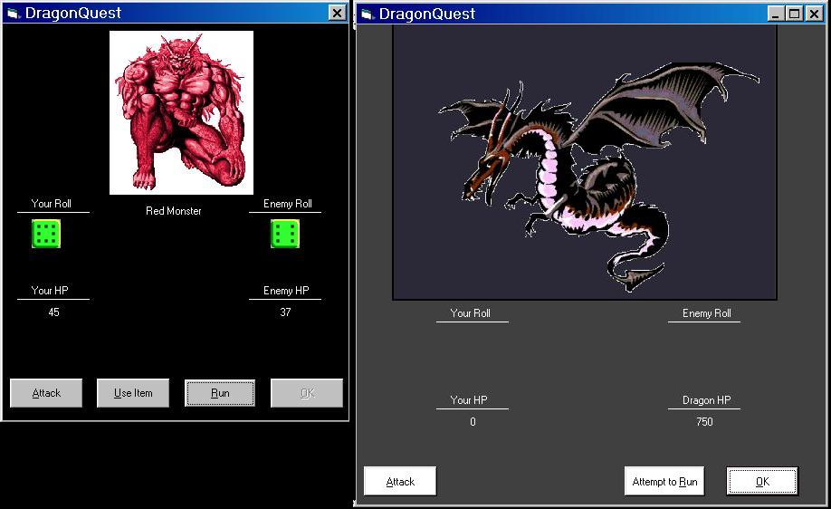



## DragonQuest \- Game

### Description

This is a game I wrote awhile back called DragonQuest. You basically are trying to fight your way to the top and become strong enough to defeat the dragon. Along the way you will visit: your home, weapon/armor/item shop, the trainer to advance your training, the forest to fight monsters and gain experience/gold and to search for the ever ellusive dragon. It uses SQL and all VB coding with an Access database. I know the graphics are horrible so please don't flame me over them. I commented where I could but there is a lot of repetitive code. All battles are performed with a dice-rolling competition (learn how to do random dice rolls and show the correct dice). If the players roll is higher than or equal to the monsters, he/she wins the attack. I hope someone learns something from this. Please comment and vote. I am thinking about upgrading this with DirectX and sounds but I don't know. I guess I'll see what kind of response I get here.

Thank You
 
### More Info
 

             |
---                |---
**Submitted On**   |2004-11-09 19:25:24
**By**             |[Capp00](https://github.com/Planet-Source-Code/PSCIndex/blob/master/ByAuthor/capp00.md)
**Level**          |Intermediate
**User Rating**    |5.0 (10 globes from 2 users)
**Compatibility**  |VB 6\.0
**Category**       |[Games](https://github.com/Planet-Source-Code/PSCIndex/blob/master/ByCategory/games__1-38.md)
**World**          |[Visual Basic](https://github.com/Planet-Source-Code/PSCIndex/blob/master/ByWorld/visual-basic.md)
**Archive File**   |[DragonQues1816711192004\.zip](https://github.com/Planet-Source-Code/capp00-dragonquest-game__1-57178/archive/master.zip)

